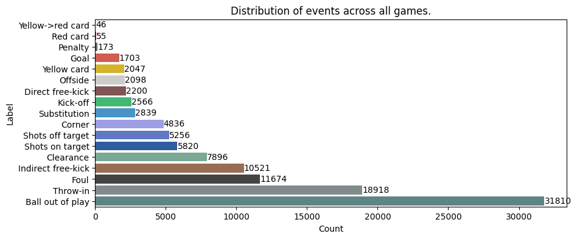
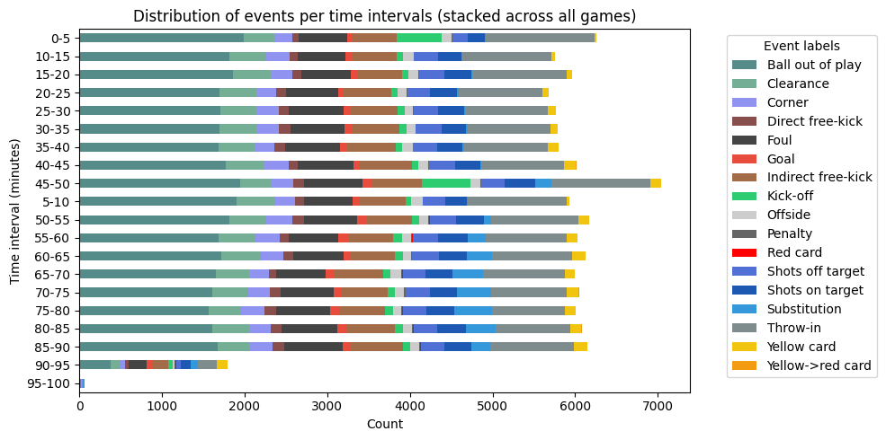

# Football Event Extractor

## Description

Computer Vision program to train a model capable of extracting key events from a football game footage.
Recognized key events include goals, free-kicks, red cards, penalties, and others.

## Motivation

This project was built for the TAAC class (Advanced Topics in Machine Learning) at the Faculty of Engineering of the University of Porto.

It it based on the SoccerNet dataset (https://www.soccer-net.org/data) and the research paper "SoccerNet: A Scalable Dataset for Action Spotting in Soccer Videos" by Silvio Giancola, Mohieddine Amine, Tarek Dghaily and Bernard Ghanem.

## Data exploration





## Usage 

To run the streamlit app, use the following command at the root of the project :

```
streamlit run src/app.py --server.maxUploadSize 1000
```
